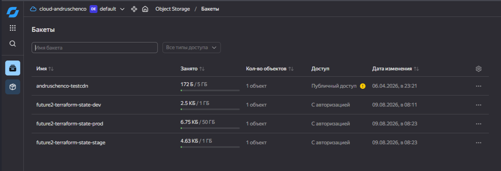

#  Задание 2. Интеграция с CI/CD и удалённым хранением состояния

Автоматизация развёртывания инфраструктуры через CI/CD с хранением состояния Terraform в Yandex Object Storage (S3-совместимое хранилище).

## Архитектура

```
┌──────────────────────────────────────────────────────────────┐
│                      GitLab CI/CD                            │
│  ┌──────────┐    ┌──────────┐    ┌───────────┐               │
│  │ Validate │───▶│   Plan   │───▶│   Apply   │               │
│  │  (авто)  │    │  (авто)  │    │ (ручное   │               │
│  │          │    │          │    │ для stage │               │
│  │          │    │          │    │  и prod)  │               │
│  └──────────┘    └──────────┘    └───────────┘               │
└──────────────────────────────────────────────────────────────┘
                           │
                           ▼
┌──────────────────────────────────────────────────────────────┐
│                 Yandex Object Storage (S3)                   │
│  ┌─────────────────┬──────────────────┬───────────────────┐  │
│  │ State: dev      │ State: stage     │ State: prod       │  │
│  │ Бакет: ...-dev  │ Бакет: ...-stage │ Бакет: ...-prod   │  │
│  │ Ключ: dev/      │ Ключ: stage/     │ Ключ: prod/       │  │
│  │   terraform.    │   terraform.     │   terraform.      │  │
│  │   tfstate       │   tfstate        │   tfstate         │  │
│  └─────────────────┴──────────────────┴───────────────────┘  │
└──────────────────────────────────────────────────────────────┘
                           │
                           ▼
┌──────────────────────────────────────────────────────────────┐
│                   Модуль Terraform (vm)                      │
│  ┌────────────────────────────────────────────────────────┐  │
│  │  Ресурсы terraform_data (симуляция ВМ)                 │  │
│  │  • Dev:  2 ресурса                                     │  │
│  │  • Stage: 4 ресурса                                    │  │
│  │  • Prod:  6 ресурсов                                   │  │
│  └────────────────────────────────────────────────────────┘  │
└──────────────────────────────────────────────────────────────┘
```

## Структура проекта

```
Task2Advanced/
├── modules/
│   └── vm/                    # Переиспользуемый модуль ВМ
│       ├── main.tf            # Ресурсы terraform_data
│       ├── variables.tf       # Входные переменные
│       ├── outputs.tf         # Выходные значения
│       └── README.md          # Документация модуля
├── envs/
│   ├── dev/                   # Среда разработки
│   │   ├── main.tf            # Вызов модуля
│   │   ├── variables.tf       # Переменные окружения
│   │   ├── terraform.tfvars   # Значения для dev (2 ВМ)
│   │   ├── backend.tf         # Конфигурация remote state
│   │   └── provider.tf        # Требования к провайдерам
│   ├── stage/                 # Среда тестирования (4 ВМ)
│   │   └── ...                # Та же структура, что и dev
│   └── prod/                  # Продуктовая среда (6 ВМ)
│       └── ...                # Та же структура, что и dev
├── scripts/
│   ├── test-dev.ps1           # Развёртывание dev
│   ├── test-stage.ps1         # Развёртывание stage
│   └── test-prod.ps1          # Развёртывание prod
├── .gitlab-ci.yml             # Пайплайн CI/CD
├── .gitignore                 # Исключения git
├── .env.example               # Пример переменных окружения
└── README.md                  # Текущий файл
```

## Ключевые проектные решения

### 1. Универсальная конфигурация backend

Файл `backend.tf` **одинаков для всех окружений**. 
Параметры, специфичные для окружения (`bucket`, `key`), передаются через командную строку.

#### Скрипты: 
- [test-dev.ps1](scripts/test-dev.ps1)
- [test-prod.ps1](scripts/test-prod.ps1)
- [test-stage.ps1](scripts/test-stage.ps1)

### 2. Изоляция окружений

| Параметр       | Dev                           | Stage                           | Prod                           |
|----------------|-------------------------------|---------------------------------|--------------------------------|
| Бакет          | `future2-terraform-state-dev` | `future2-terraform-state-stage` | `future2-terraform-state-prod` |
| Ключ состояния | `dev/terraform.tfstate`       | `stage/terraform.tfstate`       | `prod/terraform.tfstate`       |
| Количество ВМ  | 2                             | 4                               | 6                              |
| Применение     | Авто при пуше                 | Ручное                          | Ручное по тегу                 |

### 3. Безопасность

- **Состояние не хранится локально**: `*.tfstate` и `*.tfstate.*` добавлены в `.gitignore`
- **Учётные данные не в коде**: ключи загружаются из файла `.env` (исключён из git)
- **Чувствительные переменные**: помечены как `sensitive = true`
- **Раздельные бакеты**: каждое окружение имеет изолированное хранилище состояния
- **Переменные CI/CD**: учётные данные передаются через GitLab CI/CD Variables (маскируются в логах)

### 4. Отсутствие внешних зависимостей

Модуль использует встроенный ресурс `terraform_data` не используем внешних провайдеров.

## Быстрый старт

### Предварительные требования

1. **Доступ в Yandex Cloud** 
2. **Сервисный аккаунт** под задачу с ролью `storage.admin`
3. **Статические ключи доступа получены** (для сервисного аккаунта)
4. **Terraform** установлен локально

### Шаг 1: Создание бакетов

Создать три бакета в Yandex Object Storage:
- `future2-terraform-state-dev`
- `future2-terraform-state-stage`
- `future2-terraform-state-prod`



### Шаг 2: Настройка учётных данных

```powershell
# Создать файл `.env` на основе `.env.example` с паармтерами: 
AWS_ACCESS_KEY_ID=YCAJxxxxxxxxxxxxxx
AWS_SECRET_ACCESS_KEY=YCMxxxxxxxxxxxxxx
```

### Шаг 3: Развёртывание

```powershell
# Развернуть dev (2 ВМ)
.\scripts\test-dev.ps1

# Развернуть stage (4 ВМ)
.\scripts\test-stage.ps1

# Развернуть prod (6 ВМ)
.\scripts\test-prod.ps1
```

## Описание скриптов

### `scripts/test-dev.ps1`

Разворачивает среду разработки:

1. **Загрузка `.env`**: читает учётные данные AWS из файла `.env`
2. **Очистка**: удаляет локальный кэш Terraform и предыдущий план
3. **Init**: `terraform init` с `-backend-config` для dev-бакета
4. **Plan**: `terraform plan` с `dev.tfvars` (2 ресурса)
5. **Apply**: `terraform apply` (с запросом подтверждения)


Пример вывода:
```
.env loaded
Directory: C:\Projects\architecture-future_pro_2_0\Task2Advanced\scripts\..\envs\dev
=== Init ===

Initializing the backend...

Successfully configured the backend "s3"! Terraform will automatically
use this backend unless the backend configuration changes.
Initializing modules...
- vms in ..\..\modules\vm

Initializing provider plugins...
- terraform.io/builtin/terraform is built in to Terraform

Terraform has been successfully initialized!

You may now begin working with Terraform. Try running "terraform plan" to see
any changes that are required for your infrastructure. All Terraform commands
should now work.

If you ever set or change modules or backend configuration for Terraform,
rerun this command to reinitialize your working directory. If you forget, other
commands will detect it and remind you to do so if necessary.
Init OK
=== Plan ===

Terraform used the selected providers to generate the following execution plan. Resource actions are indicated with the following symbols:
  + create

Terraform will perform the following actions:

  # module.vms.terraform_data.vm[0] will be created
  + resource "terraform_data" "vm" {
      + id     = (known after apply)
      + input  = {
          + disk_id     = "000000000001"
          + environment = "dev"
          + vm_id       = "00000001"
        }
      + output = (known after apply)
    }

  # module.vms.terraform_data.vm[1] will be created
  + resource "terraform_data" "vm" {
      + id     = (known after apply)
      + input  = {
          + disk_id     = "000000000002"
          + environment = "dev"
          + vm_id       = "00000002"
        }
      + output = (known after apply)
    }

Plan: 2 to add, 0 to change, 0 to destroy.

──────────────────────────────────────────────────────────────────────────────────────────────────────────────────────────────────────────────────────────────────────────────────────────────────────────────────────────────────────────────────────────────────────────────

Saved the plan to: plan.tfplan

To perform exactly these actions, run the following command to apply:
    terraform apply "plan.tfplan"
Plan OK
=== Apply ===
module.vms.terraform_data.vm[1]: Creating...
module.vms.terraform_data.vm[0]: Creating...
module.vms.terraform_data.vm[1]: Creation complete after 0s [id=3e899ec1-be30-b14c-06a6-5ee7c209bbbd]
module.vms.terraform_data.vm[0]: Creation complete after 0s [id=35622320-d6de-941b-5b27-9f5962e38957]

Apply complete! Resources: 2 added, 0 changed, 0 destroyed.
Apply OK
=== Done ===
```

### `scripts/test-stage.ps1`

Аналогичен dev, но для среды тестирования (4 ресурса). Использует бакет `future2-terraform-state-stage`.

### `scripts/test-prod.ps1`

Аналогичен dev, но для продуктовой среды (6 ресурсов). Использует бакет `future2-terraform-state-prod`.

## Пайплайн CI/CD

### `.gitlab-ci.yml`

### Пайплайн CI/CD

Пайплайн состоит из трёх этапов:

| Этап       | Описание                                  | Триггер                           |
|------------|-------------------------------------------|-----------------------------------|
| `validate` | `terraform validate` + `terraform fmt`    | При создании merge request        |
| `plan`     | `terraform plan` с сохранением артефактов | При пуше в ветку                  |
| `apply`    | `terraform apply`                         | Авто (dev) / Ручное (stage, prod) |


### Схема пайплайна

```yaml
# Dev: автоматическое применение при пуше в develop
apply:dev:
  rules:
    - if: $CI_COMMIT_BRANCH == "develop"
      when: on_success
  environment:
    name: dev

# Stage: ручное применение при пуше в main
apply:stage:
  rules:
    - if: $CI_COMMIT_BRANCH == "main"
      when: manual          # ← Требует ручного подтверждения
      allow_failure: false
  environment:
    name: stage

# Prod: ручное применение только по тегу версии
apply:prod:
  rules:
    - if: $CI_COMMIT_TAG =~ /^v\d+\.\d+\.\d+$/
      when: manual          # ← Требует ручного подтверждения
      allow_failure: false
  environment:
    name: prod
```

### Переменные CI/CD

| Переменная              | Описание                                         | Маскирование |
|-------------------------|--------------------------------------------------|--------------|
| `AWS_ACCESS_KEY_ID`     | Статический ключ доступа Yandex Cloud            | Да           |
| `AWS_SECRET_ACCESS_KEY` | Статический секретный ключ Yandex Cloud          | Да           |
| `BACKEND_BUCKET_PREFIX` | Префикс имени бакета (`future2-terraform-state`) | Нет          |


